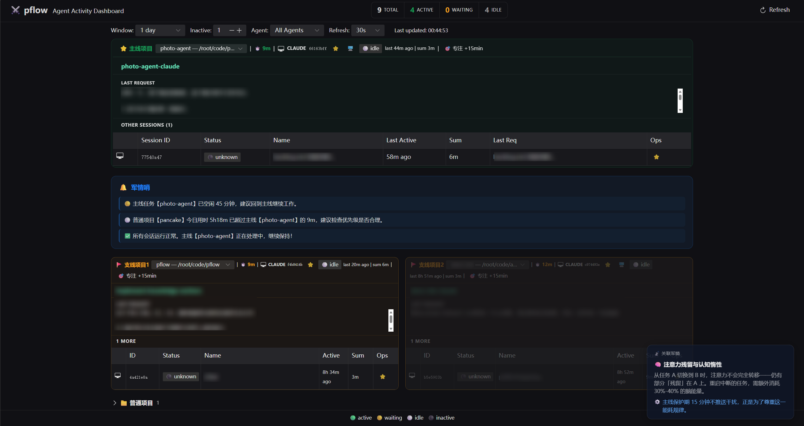

# pflow

English | [中文](./README.md)

**Multi-Agent Attention Management & Orchestration Tool**

## Have you ever run into these problems?

- Claude is coding, Hermes is writing docs — which one finishes first, and which window should you check?
- You switch to another window for a while, come back, and forget which Agent is waiting for your approval — so you start scanning terminals one by one.
- AI sessions for different projects are scattered across different terminals and tmux sessions, with no unified view of the "big picture."

pflow aggregates the state of all these AI sessions onto a single dashboard. Like a general looking at a sandtable, you see at a glance which front is fighting, which is waiting, and where you need to go.

## Dashboard Preview



## Quick Start

```bash
# Launch Web Dashboard (visit http://localhost:8080 in your browser)
pflow serve

# Start a managed Claude session in the current project (tmux auto-configured)
pflow claude -dir .

# Get today's attention recommendations (focus / switch / approval reminders)
pflow suggest
```

## Core Experience

| Scenario | What pflow does |
|----------|-----------------|
| Start an Agent session | `pflow claude -dir .` → tmux + Agent auto-configured, appears on Dashboard instantly |
| See multi-session status at a glance | Dashboard traffic lights: 🟢 Busy / 🟡 Waiting / ⚪ Idle |
| Agent needs approval | One click in the sidebar → Web terminal attaches to the same tmux session, press `1` to confirm |
| What to focus on today | Primary/Secondary strategy + reminder score algorithm → `pflow suggest` tells you next step |

## Why pflow

- **Not yet another Agent**: pflow doesn't do conversation — it does orchestration. It helps you use multiple Agents effectively, rather than burning mental energy switching between them.
- **Non-intrusive workflow**: Use Claude Code, Hermes normally in the terminal — they show up on the Dashboard automatically, without changing how you work.
- **One-click access**: From "seeing the state" to "interacting with the session" takes a single click. No more copy-pasting commands or manually attaching to tmux.

## Implemented Core Capabilities

- **Multi-Agent Monitoring**: Claude Code & Hermes dual-engine support, real-time status sync
- **Project Strategy Management**: Primary/Secondary task mapping + reminder score algorithm + attention overlay
- **Web Terminal Integration**: Dashboard sidebar one-click attach to Agent sessions (via ttyd + tmux)
- **Attention Guidance**: Focus mode protection period + Attention Commander suggestion engine (~20 static scenarios)
- **Complete Documentation**: PRD, technical design, backlog, test strategy all included

## Tech Stack

| Layer | Technology |
|-------|------------|
| CLI Framework | Cobra + Bubble Tea |
| Web Dashboard | Vue 3 + Naive UI (Go embed single-binary deployment) |
| Backend | Go (tmux management, state scanning, session mapping) |
| Agent Integration | Claude Code (statusline + JSON scanning), Hermes (export parsing) |

## Roadmap

- [x] Dual-Agent status monitoring + Web Dashboard
- [x] Project strategy management + reminder score algorithm + attention overlay
- [x] Web terminal integration + Focus Mode
- [x] Attention Commander suggestion engine (static scenarios)
- [ ] Desktop notifications (Browser Notification API)
- [ ] Attention Commander proactive push + preference learning
- [ ] Dual-layer skinning system

## Documentation

| Document | Purpose |
|----------|---------|
| [`docs/prd.md`](./docs/prd.md) | Product Requirements Document |
| [`docs/tech.md`](./docs/tech.md) | Technical Design Document |
| [`docs/backlog.md`](./docs/backlog.md) | Full Feature Backlog |
| [`docs/harness.md`](./docs/harness.md) | AI-assisted development workflow and documentation index |
| [`docs/archive/changelog.md`](./docs/archive/changelog.md) | Version history (archived) |
| [`docs/screenshot.png`](./docs/screenshot.png) | Latest Screenshot |

## License

MIT
