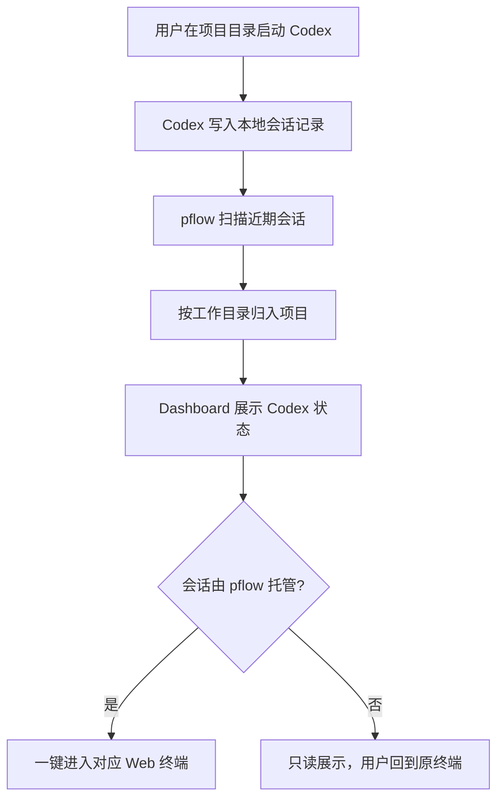

# #26 Codex 会话支持

## 需求背景

Codex CLI 已是用户的日常编程 Agent，但它的会话状态尚未进入 pflow。
用户需要在同一个 Dashboard 中看到 Codex 与已有本地会话，并在需要介入时直接回到受 pflow 托管的终端。

本期范围固定为本机交互式 Codex CLI。不会扩展为通用多 Agent 框架，也不会接入 Codex cloud、Desktop App 或 app-server。

## 设计目标

- 自动发现用户直接启动或由 pflow 启动的近期 Codex CLI 会话。
- 将可证实的活动阶段映射到 pflow 既有的忙碌、等待、空闲和未知状态。
- 保持项目归类、注意力评分、军情哨及 Web 终端入口的一致体验。
- 只读取支撑状态判断的本地会话元数据与事件，不向 Dashboard 返回完整提示词、回复或工具输入输出。

## 用户交互流程

用户也可以使用 `pflow codex` 创建托管会话。它的终端生命周期与现有 Claude/Hermes 入口一致，pflow 在启动后自动建立 Codex 会话与 tmux 会话的关联。

## 会话状态与展示

Codex 会话以持久化 rollout 记录中的会话元数据确定身份和工作目录，以事件时间线确定最近活动。只有记录中存在明确进行中或已完成信号时才给出对应状态；无法可靠区分的阶段统一显示为未知，避免将模型执行误判为等待用户。

Dashboard 沿用现有会话卡片和三色提醒表达，新增 Codex 类型标识。Codex 摘要进入项目聚合后，与其他会话一样参与提醒评分和军情哨判断。

## 关键决策

- 以本地 rollout JSONL 为只读发现源。它适用于用户正常启动的交互会话，也不需要 pflow 常驻连接 Codex。
- 以工作目录和启动时刻完成托管会话关联。关联结果保存到 pflow 自有映射文件，后续终端入口不依赖终端文字。
- 仅在本期直接接入 Codex。现有代码的局部聚合调整以保持三类会话一致为目标，不预先抽象尚未存在的 Agent 适配体系。

## 验收与手动验证

- 在已存在 Codex 会话的项目目录运行 pflow，确认 CLI 和 Dashboard 出现对应会话，项目路径及最近活动时间正确。
- 分别在 Codex 执行、需要用户输入和一段时间无新事件后刷新 Dashboard，确认状态与记录证据一致；无法判定时显示未知。
- 使用 `pflow codex -dir <项目目录>` 创建会话，待其写入会话记录后从 Dashboard 打开终端，确认进入相同 tmux 会话。
- 关闭或暂时移走 Codex 会话目录后确认错误可诊断，Claude Code 和 Hermes 会话仍正常展示。
