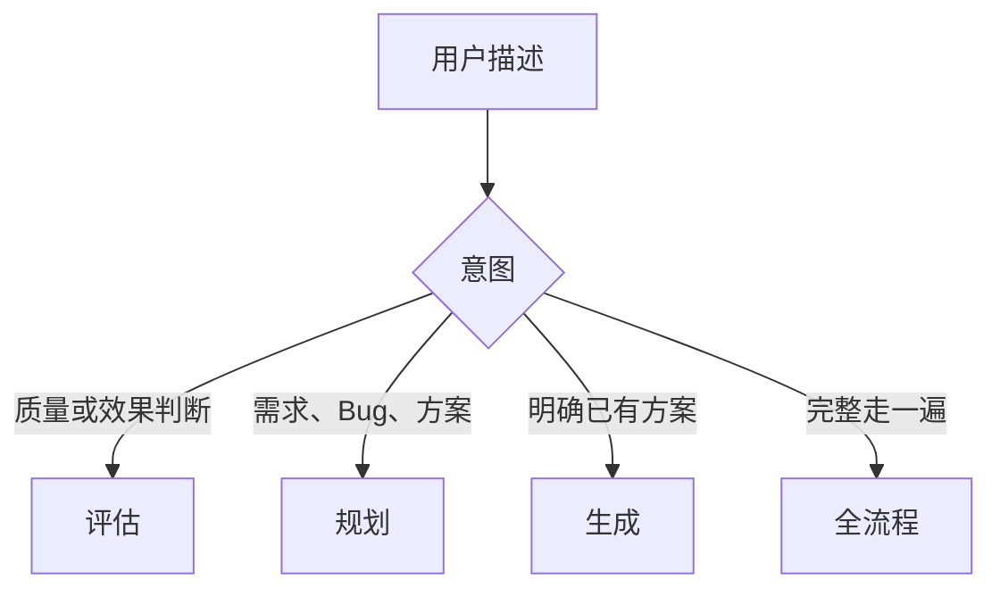

# 工作模式手册

> 本文件是 `CLAUDE.md` / `AGENTS.md` 触发词路由的详细说明。默认采用最小必要流程；复杂任务仍通过 backlog 跨会话交接。

## 反馈路由

没有明确触发词时，缺陷、效果问题和需求变更默认进入规划；简单拼写或局部逻辑错误可以直接生成。

## 评估模式

触发词：`评估`、`评估一下`、`打分`、`检查质量`。

1. 明确目标，读取相关 backlog、PRD、design、规范和代码。
2. 运行与目标匹配的验证命令，收集具体输出、测试结果和代码证据。
3. 按 [评估指南](eval-guide.md) 评分，区分通过条件与待改进问题。
4. 将报告写入 `docs/eval/reports/YYYY-MM-DD-<topic>.md`；需要机器消费时可同名写 JSON。
5. 发现问题时在 backlog 新增“待规划”条目，只写现象、影响和证据，不写方案。

评估器不修改代码，不替规划器决定修复方案。

## 规划模式

触发词：`规划一下`、`帮我设计`、`出个方案`、`怎么做`、`我发现问题`、`这里不够好`、`效果不对`、`有个 bug`。

1. 读取 `todo.md`、`docs/backlog.md`，再按范围读取 `prd.md`、`tech.md`、`docs/design/` 和 `docs/handbook/`。
2. 判断是简单、中等还是复杂任务，确认依赖、风险和验收标准。
3. 把技术方案、任务拆分和验收标准写进对应 backlog 条目；中大型任务额外创建 design 文档。
4. 将条目标记为 `Approved` 或项目约定的“已规划”状态，并说明涉及模块。

设计文档写背景、目标、用户行为、概念关系、决策和验收；不写函数名、路由、伪代码和逐步执行计划。发现需要用户配置、凭据或外部操作时，明确标记“（用户）”。

## 生成模式

触发词：`按方案执行`、`开始开发`、`实现这个`。

1. 读取已规划 backlog 条目及其关联 design、tech 和编码规范。
2. 按方案修改代码，同时为核心路径、边界和错误路径补充或运行测试。
3. 按项目命令验证：通常为 `make vet`、`make test`、`make build`，前端逻辑变化补充 `cd web && npx vue-tsc --noEmit`。
4. 同步更新 backlog、`todo.md`、验收清单和受影响的当前文档。
5. 如果发现方案与代码事实冲突，先记录实际情况，再更新文档，不保留已经落地的重复实现细节。

## 全流程模式

触发词：`完整走一遍`、`全流程`、`一站式`、`从头到尾`、`规划生成评估全流程`。

适合单文件、小范围和低风险任务。在同一会话中依次完成精简规划、实现、自检和验收；不创建独立计划文档或完整评估报告。跨模块、架构变更、数据迁移和高风险删除操作改走“规划 → 生成 → 评估”分步流程。

## 项目管理模式

触发词：`版本归档`、`归档`、`里程碑`、`版本规划`、`backlog 治理`。

- 版本归档：将已完成周期记录、审查和版本说明移入 `docs/archive/`，保留当前 backlog。
- 里程碑规划：根据 backlog 的状态、依赖和优先级提出下一周期范围。
- backlog 治理：对照代码和当前文档清理过时、重复或遗漏条目。

## Handoff 协议

### Plan → Generate

规划器把背景、方案、涉及模块、子任务和验收写入 backlog；生成器只需读取该条目及其关联文档即可工作。不要依赖上一轮对话历史。

### Evaluate → Plan

评估器把报告链接和问题现象写入 backlog；规划器读取报告中的证据后产出方案。若同一主题经历两轮以上闭环，再创建专题中枢文档，集中索引设计、报告、backlog 和时间线。
