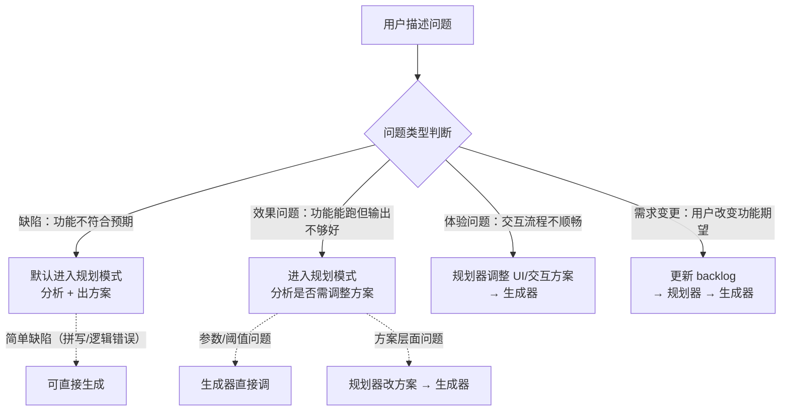

# 工作模式手册

> AI 根据用户输入的关键词自动切换工作模式。
> 本文件定义每种模式的完整流程，是 `CLAUDE.md` / `AGENTS.md` 触发词表的下游详情文档。
> 维护原则：`CLAUDE.md` 与 `AGENTS.md` 是同一套全局规则在 Claude/Codex 工作流中的双入口，任一文件修改时必须在同一轮同步修改另一文件。

## 反馈路由（顶层）

当用户以非触发词描述问题时，先判断问题类型，再路由到对应模式处理。默认路由为规划模式。

> 当用户明确要求“一次性完成规划+生成+评估”或类似表述时，路由到全流程模式，不走上述默认路由。

## 评估模式

**触发词**：`评估` / `评估一下` / `打分` / `检查质量`

> 具体评分维度和操作指南见 [eval-guide.md](eval-guide.md)。

**职责**：对代码/功能产出做质量评分。评估器是“判卷老师”，只判断好坏，不提出解决方案。

**流程**：

1. 确认评估目标（功能、代码、PR 或提交）。
2. 读取相关材料：设计方案（`docs/design/`）、编码规范、评估基线（`docs/eval/baseline.md`）和目标代码。
3. 按评分维度逐项打分，每个维度列出得分点和失分点。
4. 汇总输出评估报告到 `docs/eval/reports/`。
5. 如发现需要改进的问题，在 `docs/backlog.md` 中新增条目（状态 = Pending），只描述问题现象，不写方案。
6. 如涉及基线指标，更新 `docs/eval/baseline.md`。

**评分维度**：代码质量（正确性 / 健壮性 / 可维护性 / 简洁性）、功能效果（准确性 / 完整性 / 一致性）、用户价值（可用性 / 交互体验 / 惊喜度 / AI 增量，按功能适用时启用）。

**行为边界**：不修改代码，只收集信息和判断；不提出“应该怎么改”，只指出“哪里不够好”；后续由规划模式读取评估报告并产出改进方案。

## 规划模式

**触发词**：`规划一下` / `帮我设计` / `出个方案` / `怎么做` / `我发现问题` / `这里不够好` / `效果不对` / `有个 bug`

**流程**：

1. 确认规划对象：用户口述的新需求，或 `docs/backlog.md` 中指定条目。
2. 读取 `docs/backlog.md`、`docs/prd.md`、`docs/tech.md` 和相关当前文档；涉及配置/环境问题时，可以或申请读取 `.local/` 实际配置，不假设本地配置已就绪。
3. 检查依赖项是否满足，判断任务复杂度（简单 / 中等 / 复杂）。
4. 无论任务体量，技术方案始终写入 backlog 条目的“方案”字段，说明涉及模块、大致方向和数据流向。中大型任务额外创建 `docs/design/` 文档，聚焦功能需求、用户交互流程和关键决策理由；design 不重复 backlog 中已有的技术方案。
   - 小体量任务：方案仅写入 backlog，不创建 design 文档。
   - 中大型任务：backlog 写技术方案，额外产出 design 文档。
   - design 写需求背景、设计目标、用户交互流程、概念级数据关系、关键决策及验收标准；不写代码细节、路由、变量/函数命名、伪代码、数据结构定义、API 契约和实现步骤。
   - 所有方案保持高层抽象，不写伪代码、CSS 属性值、变量名或函数签名，给生成模式保留实现自由度。
5. 必须输出明确任务列表，任务拆分落点是 backlog 条目，不可埋在大段文字中，也不可写进 design 或中枢文档。用户需手动执行的任务以“（用户）”前缀标记。
6. 简单任务在方案中包含实现步骤；复杂任务在同一 backlog 父条目下拆分子阶段，每个阶段包含目标、涉及模块和验收标准。规划任务、子任务和实施步骤的唯一落点是 `docs/backlog.md`，不创建独立任务计划文档或 exec plan。
7. 更新 backlog 对应条目状态为 `Approved` 或项目约定的“已规划”状态，并填入方案字段。

**设计原则**：

- **根因优先**：优先寻找根因并直接修复，不叠加无必要的容错/降级逻辑。
- **主动沟通**：发现需用户介入的阻塞问题时，直接说明情况并给出选择，不默默记入 backlog。
- **方案保持高层抽象**：只描述要达到的效果、交互行为和大致方向，不预设实现细节。

**方案改动确认规则**：默认给出简要方案后直接修改文档与代码，不再询问“是否按此方案改”。只有存在多个可行方案需用户选择，或改动涉及数据迁移、删除数据、外部发布等较大成本/后果时停下来询问。用户主动说“全自动修改”等意思时无需确认。

## 生成模式

**触发词**：`按方案执行` / `开始开发` / `实现这个` / `完成开发`

**流程**：

1. 确认执行对象：指定方案文档，或 `docs/backlog.md` 中状态为“已规划”的条目。
2. 读取方案文档、`docs/tech.md` 和 `docs/handbook/coding-conventions.md`。
3. 按方案中的实现步骤执行，每步完成后编译和测试自检。
4. 全部实现完成后，检查 tech.md 中是否存在已落地为代码的技术细节，如有则删除，避免文档与代码重复维护。
5. 文档同步必须逐项完成：
   - 更新 backlog 任务总览表中的状态；
   - 更新 backlog 任务详情中的状态、方案和验收；
   - 在方案文档的实现步骤中勾选已完成项；
   - 验收清单中代码侧已覆盖的项勾选完成，运行时验证项标注“需运行时”并留待用户确认。

## 项目管理模式

**触发词**：`版本归档` / `归档` / `里程碑` / `版本规划` / `迭代计划`

**流程**：

1. 确认任务类型：版本归档、里程碑规划，还是 backlog 治理。
2. 读取 `docs/backlog.md` 和 `docs/archive/` 了解当前版本状态。
3. 按任务类型执行：
   - **版本归档**：识别 Done 条目 → 创建或更新 `docs/archive/vX.Y.Z.md` → 将 Done 条目的完整信息迁移到版本归档 → 从 backlog 任务总览和详情中删除已归档条目，仅保留未完成条目 → 更新入口和决策历史。
   - **里程碑规划**：梳理剩余 backlog → 评估优先级和依赖关系 → 排定下一版本范围建议 → 更新 backlog 状态。
   - **backlog 治理**：交叉比对 backlog 与实际代码 → 识别过时、重复或遗漏条目 → 清理并给出变更摘要。
4. 给出执行结果和变更摘要，等用户确认。

## 全流程模式

**触发词**：`完整走一遍` / `全流程` / `一站式` / `从头到尾` / `整个工作流` / `规划生成评估全流程`

> 本模式串联规划 → 生成 → 评估三个环节，在单次会话中跑完一个小体量任务的完整闭环。定位是轻量快捷，不走跨会话 handoff、独立 design 文档或完整评估报告。

**适用判断**：适合单文件改动、简单逻辑修复、参数调整、加日志/错误处理和纯前端交互微调；不适合跨模块、架构决策、子阶段拆分、数据迁移和高风险删除，应引导用户走规划 → `/clear` → 生成 → `/clear` → 评估。

**流程**：

### 阶段 1：规划

1. 读取 backlog 条目和相关代码，产出精简方案，直接写入 backlog 条目的“方案”字段，不创建 design。
2. 有多个选项时提供选择并等用户确认；仅一个选项且成本/后果可控时简述后直接进入生成。
3. 更新 backlog 条目状态为“已规划”。

### 阶段 2：生成

1. 按确认方案实现代码。
2. 验证自检不可跳过：编译通过；为核心路径、边界和异常输入编写/运行测试并全部通过；涉及日志时确认 warning/error 路径确实触发。
3. 文档同步不可跳过：更新 backlog 总览、详情状态/方案/验收；删除 tech.md 中已落地的实现细节。

### 阶段 3：评估

1. 对照 backlog 验收标准逐项自检，给出 Pass/Fail。
2. 对核心逻辑做快速风险评估，检查回归和边界遗漏。
3. 全部通过则更新 backlog 为 Done，并总结改动和测试结果；发现问题则在对话中指出，让用户决定立即修复还是留到下一轮。

**行为约束**：三个阶段在同一会话中连续执行；阶段 1 是唯一阻塞点；阶段 2 验证不可跳过；阶段 3 只做轻量自检，不产出独立评估报告或中枢文档；新问题写入 backlog 并由用户决定是否继续。

## 角色间 Handoff：Plan → Generate

1. 规划器将方案写入 backlog 对应条目的“方案”字段，并更新状态为“已规划”。
2. 用户在新对话中让 AI 读取该条目，进入生成模式执行。
3. backlog 条目使用状态 / 背景 / 方案 / 分析 / 验收结构，使新会话无需依赖对话历史。
4. 若需求已有专题中枢，在方案文档中增加反向链接，并在中枢文档中更新阶段状态。

## 角色间 Handoff：Eval → Plan

1. 评估器将报告写入 `docs/eval/reports/`；发现问题时在 backlog 新增 Pending 条目，只描述现象和严重程度，不写方案。
2. 用户在新对话中让 AI 读取评估报告和 backlog 条目，进入规划模式。
3. 评估报告与 backlog 问题条目共同构成交接内容。
4. 检查该需求是否已经历至少两轮规划/开发/评估；若是，创建或更新专题中枢文档。

## 专题中枢文档

### 何时创建

以下条件全部满足时创建：同一需求经历至少两轮评估/规划/生成循环；产生了分散在多个文档中的衍生问题；存在多份评估报告或设计文档指向同一主题。由当前轮次操作者主动创建或更新。

### 内容与命名

中枢应包含专题总览、关联文档索引、完整时间线、当前各项完成度、下一轮方向性建议、Git 提交记录和设计决策记录。下一轮建议只给方向，不承载任务拆分和实施步骤。

命名：`docs/design/YYYY-MM-DD-<序号>-<topic-slug>-hub.md`。日期与普通 design 一致，序号与同主题第一份方案一致，`-hub` 表示中枢。

### 维护与反向链接

- 所有被中枢引用的设计文档和评估基线，应在顶部元数据区增加指向中枢的反向链接。
- 中枢创建后，每次该专题经过评估、规划或生成都要更新时间线、完成度和下一轮建议。
- 新产生的衍生问题追加到关联 backlog 条目表。

## design、backlog、tech 的职责分离

- `docs/design/`：功能视角，写需求背景、设计目标、用户交互、概念关系、关键决策和验收标准，不写代码细节。
- `docs/backlog.md` 条目“方案”：技术视角与任务交接唯一载体，写模块、数据流向、模块交互、迁移策略和子阶段拆分，不写伪代码和变量名。
- `docs/tech.md`：规划阶段的临时技术参照，代码落地后删除已实现的结构体、数据模型、API 路由和代码示例，避免重复维护。
- 简单方案可跳过 tech 和 design，由 backlog 条目直接驱动生成。

## 文档设计原则

- 设计文档只描述当前生效方案；中间方案和讨论性内容被更优方案替代后直接覆盖。
- 经明确否决且对后续有约束的方向记录到 `docs/archive/` 的决策/参考材料中，避免重复提出。
- 设计文档不写“曾考虑但未采用”或“不需要”等否定性叙述。
- 已完成的功能从 backlog 中的当前工作区删除，完整记录保留在对应版本归档；不要在当前 backlog 中重复描述已实现功能。
