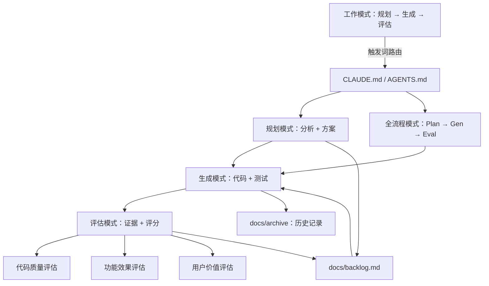

# Harness Engineering — 架构概览

> Harness 是 pflow 项目的 AI 辅助开发工作流体系，包含工作模式、评估系统和项目文档交接三个子系统。
> 本文档是 Harness 的高层架构索引，只描述模块职责和关联关系，不展开实现细节。

## 1. 整体架构

## 2. 子系统

### 2.1 工作模式

AI 根据用户输入的触发词自动切换工作模式。评估、规划、生成、项目管理和全流程模式共同形成可交接的闭环。完整流程、方案确认边界、handoff 和专题中枢规则见 [`handbook/work-modes.md`](handbook/work-modes.md)。

### 2.2 评估系统

评估从代码质量、功能效果和用户价值三个层面收集证据并评分。评估器只判断好坏，不提出修复方案；发现问题时将现象写入 backlog，由规划模式负责后续方案。

评估报告放在 `docs/eval/reports/`，评估基线放在 [`eval/baseline.md`](eval/baseline.md)。pflow 不依赖在线 LLM judge，采用可复现的命令行、单元测试、前端类型检查和按功能设计执行的手动验收。

### 2.3 文档交接

`docs/backlog.md` 是 Plan → Generate 的唯一交接载体，条目使用状态、背景、方案、分析和验收字段传递上下文。版本归档时，Done 条目的完整信息迁移到 `docs/archive/`，并从 backlog 的总览和详情中清除，只保留未完成条目。

## 3. 文档索引

### 流程与规范

- [`handbook/work-modes.md`](handbook/work-modes.md) — 工作模式完整流程、路由和 handoff
- [`handbook/eval-guide.md`](handbook/eval-guide.md) — AI 评估模式操作指南
- [`handbook/coding-conventions.md`](handbook/coding-conventions.md) — Go、Web、Markdown 编码规范
- [`handbook/doc-review.md`](handbook/doc-review.md) — 文档内部治理和源码对齐
- [`../CLAUDE.md`](../CLAUDE.md) — Claude 工作流入口
- [`../AGENTS.md`](../AGENTS.md) — Codex 工作流入口

### 项目文档

- [`prd.md`](prd.md) — 产品需求、用户故事和验收标准
- [`tech.md`](tech.md) — 当前架构、API 契约和数据模型
- [`backlog.md`](backlog.md) — 需求池和唯一交接载体
- [`design/`](design/) — 当前功能设计
- [`eval/`](eval/) — 评估基线和报告
- [`testing.md`](testing.md) — 测试策略
- [`archive/`](archive/) — 已完成版本和历史材料

## 4. 关键设计决策

- **评估不修改代码**：评估器只判断好坏，改进方案由规划模式产出。
- **角色间 handoff**：通过 backlog 条目传递上下文，不依赖对话历史。
- **规划落点唯一**：方案、子任务和实施步骤写入 backlog，不创建独立任务计划文档。
- **中枢文档按需创建**：同一需求经历至少两轮循环且产生多份关联产物时，创建专题中枢文档统一索引。
- **归档清理明确**：版本归档完成后，backlog 只保留未完成事项，历史证据保留在 archive。
- **全流程模式轻量化**：适合单文件和低风险改动；跨模块、数据迁移和高风险删除走标准分步流程。
