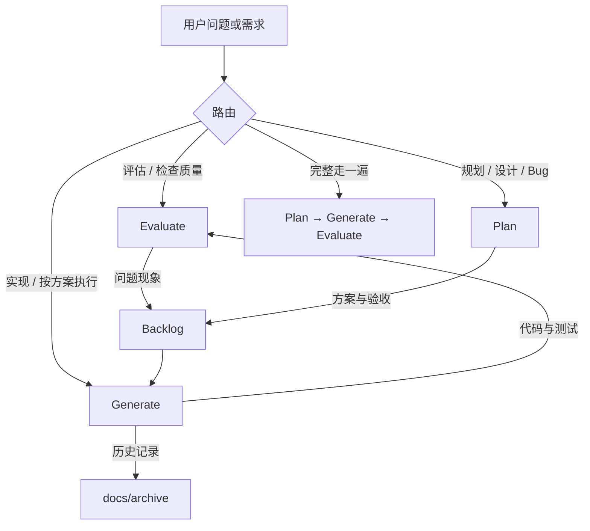

# pflow Harness

> pflow 的 AI 辅助开发工作流入口。Harness 负责把需求、规划、实现、验证和归档连接起来；代码仍是实现的唯一真相源。

## 1. 架构概览

Harness 的交接载体是 `docs/backlog.md`。设计文档解释功能和决策，backlog 记录可执行方案与验收，评估记录事实和问题；三者不互相替代。

## 2. 文档入口

### AI 工作手册

- [工作模式](handbook/work-modes.md)：评估、规划、生成、全流程和项目管理的触发词、流程与 handoff
- [编码与验证规范](handbook/coding-conventions.md)：Go、Vue/TypeScript、文档和测试约束
- [评估指南](handbook/eval-guide.md)：pflow 的代码质量、功能效果和用户价值评估方法
- [文档审阅](handbook/doc-review.md)：文档治理、源码对齐和归档规则

### 项目文档

- [产品需求](prd.md)
- [技术架构](tech.md)
- [Backlog](backlog.md)：规划与生成之间的唯一交接点
- [当前周期](../todo.md)
- [设计文档](design/)
- [评估基线](eval/baseline.md)
- [测试策略](testing.md)
- [评估报告](eval/reports/)

### 历史材料

- [归档目录](archive/)
- [周期记录](archive/cycles/)
- [旧版参考笔记](archive/legacy/note.md)

## 3. 维护约束

- `CLAUDE.md` 与 `AGENTS.md` 必须同步修改，内容保持一致。
- 每次开发开始先读 `todo.md`；跨模块或有架构影响的工作还要读相关 PRD、tech、design 和 backlog 条目。
- 方案写入 backlog；中大型功能再创建 design 文档。任务拆分不另建计划文档。
- 评估只记录证据、分数和问题现象，不在评估阶段写修复方案。
- 完成的周期记录、一次性审查和版本记录进入 `docs/archive/`，当前有效结论迁移到 handbook、tech、design 或 backlog。
- 新文档必须使用仓库相对链接，并在提交前检查目标文件存在。

## 4. 当前评估范围

pflow 没有独立的 LLM judge 或在线评估服务。Harness 采用可复现的人工/命令行评估：`make vet`、`make test`、`make build`、前端类型检查，以及按功能设计执行的手动验收。评估报告放在 `docs/eval/reports/`，仅在确实执行评估时创建。
